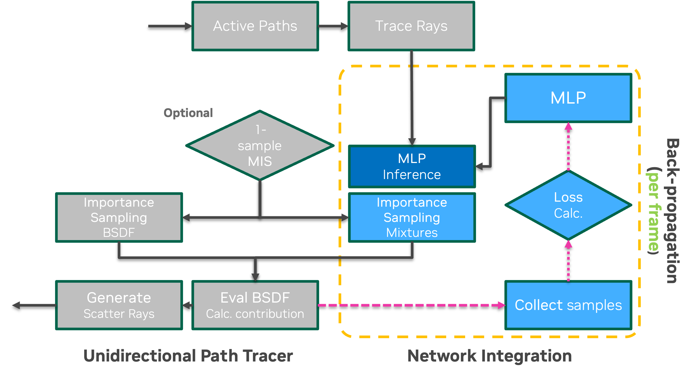

# Neural Mixture Guiding 

This is our GPU prototype implementation of the work *Neural Parametric Mixtures for Path Guiding*. This work presents an lightweight alternative for neural path guding that is practical for GPU parallel rendering, letting the MLP predict the parameterized analytical mixtures, which may not as expressive as implicit models (e.g., normalizing flow) but faster. In this version of code, we integrated our algorithm into a wavefront path tracer using OptiX and implemented networks with *tiny-cuda-nn*, while manually implementing the derivative computation routines. We also refer interested readers to a concurrent work [Online Neural Path Guiding with Normalized Anisotropic Spherical Gaussians](https://dl.acm.org/doi/10.1145/3649310) which contains a similar idea and comprehensive experiments.

### Building and Run

#### Requirements

- Nvidia RTX GPU (with HWRT support).
- OptiX **7.3+** and CUDA **11.4+** (but not all of them might work, tested on 11.5/11.8).
- Newer versions of **MSVC** (**Windows only**).

#### Building

This project uses CMake to build, no additional setting is needed. Make sure cuda is installed and added to PATH. While it tries to guess the OptiX installation path (i.e., the default installation directory on Windows), you may specify the `OptiX_INSTALL_DIR` environment variable manually in case it failed. Refer to the CI [configuration file](.github/workflows/main.yml) for a tested environment setup and build steps.

#### Interactive Rendering Mode (unstable)

There is an interactive rendering mode where you can explore the scene by moving the camera with path guiding enabled. Use the interactive config to play with it: `common/configs/render/interactive.json`. Use LShift, LMButton, and scroll to control the orbit camera. Guiding is disabled by default in this mode, check the "Enable Training" box in the GUI -> GuidedPathTracer to enable guiding (and uncheck to disable it). You can also directly run `testbed.exe` without any arguments to enter this default configuration once the project is built.

#### Offline Rendering Mode 

To run an offline rendering task, two configuration file need to be provided via command line arguments: the scene configuration and the method configuration. We have provided some configurations (.json files) for equal-sample experiments in this code. Example: 

~~~bash
build/src/testbed.exe -scene common/configs/scenes/veach-ajar.json -method common/configs/render/guided.json
~~~

##### Scene configuration

Containing the path to 3D scene file, camera configurations, etc. Specify this with `-scene`. We bundled some example scenes in `common/configs/scenes/`, including Veach-Ajar, Bathroom, and Veach-Egg. 

##### Method configuration  

Containing the rendering method, and its parameters. Specify this with `-method`. Example: `common/configs/render/guided.json` and  `common/configs/render/pt_bsdf.json`. (The *guided* refers to NPM learning the full distribution, i.e., $L_i \times f_{\mathrm{s}}  \cos$). The meaning of the specific parameters in the configuration could be inspected in the [code](src/render/guided).

##### Run experiments with python script

If the pybind11 python binding is built successfully, the renderer could be called from the scripts. See the sample script at `scripts/run.py`or  `scripts/run_experiments.py`. Running with python script also comes with a built-in error calculator.

##### Notes

The rendering code has some changes after the experiments, but the error metrics should still be similar, hopefully if nothing goes wrong. However,

- The metric might have small perturbations from run to run as the parallel training sample collection & gradient reduction process is non-deterministic.
- We even have observed a different training convergence and error due to switching CUDA versions. A recent test is on *CUDA 11.8 and 12.1* and seems OK. 

#### See the implementation in 1 min

This integration scheme could be suitable for either CPU or GPU (wavefront/megakernel) renderer, while in this code base we used a toy wavefront ray tracer. Out implementation of this renderer is similar to PBRT-v4 but with interactive frame rates. When being integrated into a megakernel path tracer one might want specific APIs to handle the inline MLP inference and thread divergence (e.g., shader execution reordering).

### Issues

**Missing Features**: the ***pixel sample weighting*** scheme (e.g., inverse-variance weighting) and ***learnable selection probability*** are not implemented in this version.  *In experiments and comparisons we disabled these features for all the methods.* An option is also provided to enable a simple pixel weighting scheme (`sample_weighting`, disabled by default) to scale down the weight of the earlier samples, similar to that suggested by *Huang et al.* 

**Could this facilitate real-time ray-tracing?**
We believe yes if with careful implementation. However, these local guiding techniques are often vulnerable to the high-frequency contribution from distance and drastic animated objects. This makes them hard to fit the distribution in large scale scenes with many lights. In general, ReSTIR-based methods are better alternatives for real-time ray tracing with practical overhead.

**Is it comparable to the state-of-the-art?**
Possibly no. In our experiments we only compared with PPG-based methods. In terms of equal-sample-rate quality we believe the normalizing flows (used in Neural Importance Sampling) should have the best modeling capability although computationally expensive. Moreover, the PPG technique is re-implemented with CUDA, which might result in some kind of performance loss in this code base than the original CPU ver. Our implementation and configuration used in PPG's experiments are in the supplemental material in the project website / DL page.

**Possible future improvements for a more practical implementation?**
(1) Shallower network if performance is in demand (quality would not degrade by too much when feature grids are used); (2) Zero-contribution sample culling (they will not contribute to gradients); (3) utilize HW-accelerated filtering to sample dense feature grids; (4) alternative output parameterization (e.g., $(x, y, z)$ instead of $(\theta, \phi)$).

We feel some of the above aspects should have been discussed in the paper, but our knowledge is somewhat limited at that time, and we are sorry for that. In case of questions or issues welcome to [contact](mailto:2101213024@pku.edu.cn) the author (who is away from school/research now but might still be able to help) or the corresponding author.
